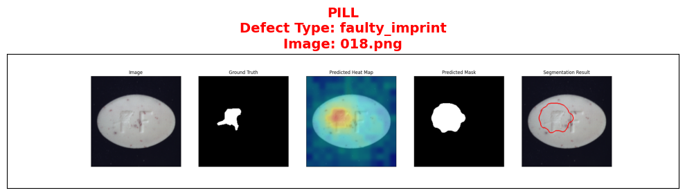
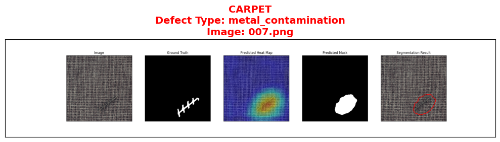
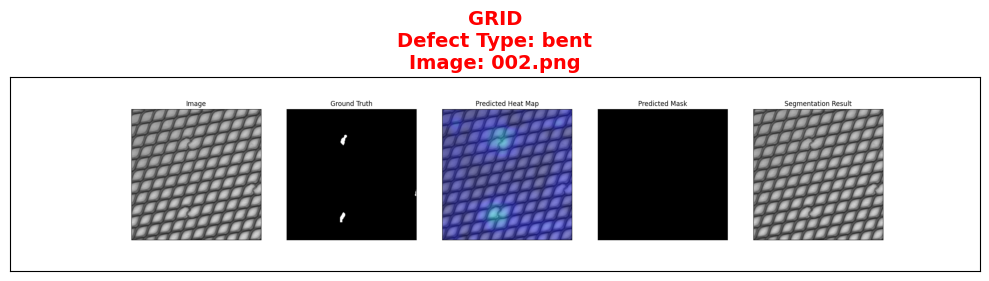

# PatchCore (EfficientNet-B5) on MVTEC-AD

---

## 🎯 Goal

To train and evaluate an **anomaly detection model** using **PatchCore** with a **custom EfficientNet-B5 backbone** on the **MVTEC Anomaly Detection (MVTEC-AD)** dataset.
The goal is to detect and localize surface and structural defects across 15 industrial object categories.

---

## 🧩 Task

* Detect **defective samples** in images from various industrial categories.
* Localize **anomalous regions** (pixel-level heatmaps).
* Evaluate using **Image-level AUROC**, **Pixel-level AUROC**, and **Pixel-level F1-score**.
* Generate visual results (defect overlays) and per-category performance summaries.

---
<center></center>

---

[Anomalib](https://github.com/openvinotoolkit/anomalib): Anomalib is a deep learning library that aims to collect state-of-the-art anomaly detection algorithms for benchmarking on both public and private datasets. Anomalib provides several ready-to-use implementations of anomaly detection algorithms described in the recent literature, as well as a set of tools that facilitate the development and implementation of custom models. The library has a strong focus on image-based anomaly detection, where the goal of the algorithm is to identify anomalous images, or anomalous pixel regions within images in a dataset.


## 📚 Dataset

**Dataset:** MVTEC-AD
**Source:** [Kaggle Mirror – MVTEC AD](https://www.kaggle.com/datasets/ipythonx/mvtec-ad)
**Categories (15 total):**
bottle, cable, capsule, carpet, grid, hazelnut, leather, metal_nut, pill, screw, tile, toothbrush, transistor, wood, zipper

**Structure:**

```
mvtec-ad/
 ├─ bottle/
 │   ├─ train/good/
 │   └─ test/{good, defect_type}/
 ├─ cable/
 │   ├─ train/good/
 │   └─ test/{good, defect_type}/
 ...
```

**Preprocessing:**

* Images resized to `256×256`
* Center crop `224×224`
* Normalized with ImageNet mean and std

---

## 🧠 Model

**Base Framework:** [Anomalib v0.7.0](https://github.com/openvinotoolkit/anomalib)
**Architecture:** PatchCore
**Feature Extractor:** EfficientNet-B5 (custom wrapper using TIMM)

**Key Parameters:**

| Parameter              | Value                                |
| ---------------------- | ------------------------------------ |
| Backbone               | efficientnet_b5                      |
| Layers Used            | ['blocks.2', 'blocks.4', 'blocks.6'] |
| Coreset Sampling Ratio | 0.1                                  |
| Num Neighbors (k)      | 9                                    |
| Batch Size             | 32                                   |
| Image Size             | 256×256                              |
| Optimizer              | Adam                                 |
| Max Epochs             | 1–5 (per category)                   |
| Framework              | PyTorch Lightning (<2.0)             |

---

## 🧪 Results

| Category   | Image AUROC | Pixel AUROC | Pixel F1 |
| ---------- | ----------- | ----------- | -------- |
| bottle     | 1.0000      | 0.9640      | 0.6342   |
| cable      | 0.9878      | 0.9740      | 0.5952   |
| capsule    | 0.9154      | 0.9837      | 0.4922   |
| carpet     | 0.9992      | 0.9836      | 0.5527   |
| grid       | 0.9641      | 0.9533      | 0.2385   |
| hazelnut   | 0.9993      | 0.9810      | 0.5772   |
| leather    | 1.0000      | 0.9820      | 0.3537   |
| metal_nut  | 1.0000      | 0.9689      | 0.7745   |
| pill       | 0.9569      | 0.9528      | 0.6050   |
| screw      | 0.9309      | 0.9724      | 0.2910   |
| tile       | 0.9870      | 0.9443      | 0.6046   |
| toothbrush | 0.9889      | 0.9799      | 0.5543   |
| transistor | 0.9987      | 0.9780      | 0.7013   |
| wood       | 0.9798      | 0.9083      | 0.4600   |
| zipper     | 0.9947      | 0.9703      | 0.4844   |

**Observations:**

* Image-level AUROC is **consistently high (>0.95)** across almost all categories.
* Pixel-level localization is moderate; some classes like *grid* and *screw* need threshold tuning.
* Categories like *metal_nut*, *transistor*, and *bottle* achieved the best segmentation quality.

---

## 🎨 Visualization

Example visualizations are generated and saved in:

```





```

Each includes:

* Input Image
* Predicted Anomaly Map
* Overlayed Defect Visualization

---

## 🧾 Summary

* **Framework:** PyTorch Lightning + Anomalib
* **Model:** PatchCore (EfficientNet-B5 Backbone)
* **Dataset:** MVTEC-AD (15 categories)
* **Goal:** Detect and localize industrial defects
* **Best Performing Categories:** *metal_nut*, *bottle*, *transistor*
* **Weak Localization:** *grid*, *screw*, *leather*

---

 
